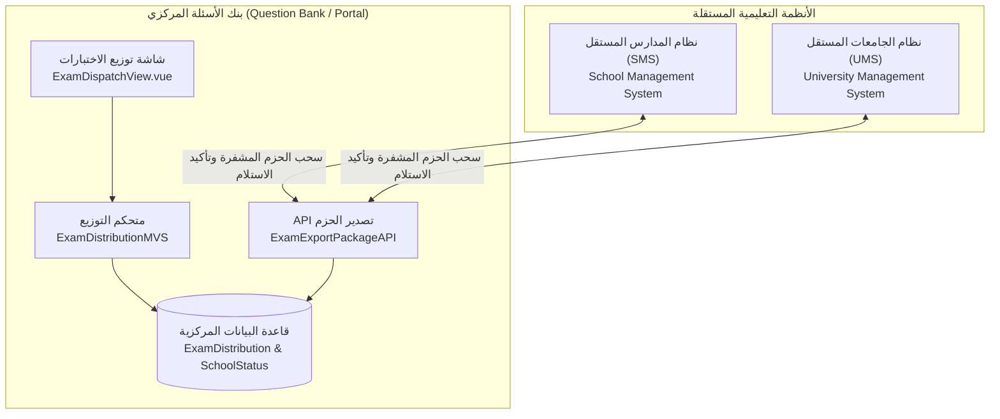

# خطة تنفيذ نظام توزيع وتصدير الاختبارات المجدول (Exam Distribution & Scheduled Export System)

يهدف هذا النظام إلى تمكين إدارة الامتحانات المركزية في بنك الأسئلة من **تصدير وتوزيع الاختبارات المعتمدة** ونماذجها (A, B, C, D) وقوالب تصحيحها (OMR) إلى **أنظمة المدارس (SMS) والجامعات (UMS) الخارجية المستقلة** وفق استهداف هرمي دقيق وجدولة زمنية محكمة تضمن السرية ومنع التسريب.

---

## 1. نمط التكامل المعماري (Architecture & Integration)

النظام سيعتمد نمط **Pull-based Sync المعتمد على البوابة الموحدة** (المتبع حالياً في `d_services/apis/portal_export.py`):
1. **الجدولة المركزية:** بنك الأسئلة ينشئ سجل التوزيع ويحدد المستهدفين (محافظة / مديرية / مدارس) ونوافذ الوقت.
2. **سحب الحزمة:** نظام المدرسة الخارجي يتصل بالـ API:
   `GET /api/exams/export/package/?school_branch_no=50001`
3. **التأكيد اللحظي:** نظام المدرسة يرسل إشعار استلام:
   `POST /api/exams/export/package/ack/`
4. **فتح القفل:** يتم فك حجب الأسئلة في الوقت المحدد (`accessible_from`) لتبدأ المدرسة في طباعة كراسات الأسئلة وأوراق OMR أو تهيئة شاشات الامتحان الإلكتروني.

---

## 2. نماذج قاعدة البيانات (Backend Models)

### أ. نموذج إدارة مهمة التوزيع (`ExamDistribution`)
* **`exam`**: الاختبار المعتمد المطلوب توزيعه.
* **`title`**: عنوان مهمة التوزيع (مثال: "امتحان نصف الفصل الأول - رياضيات ثالث ثانوي").
* **`target_level`**: مستوى الاستهداف ('ministry', 'governorate', 'directorate', 'school', 'university').
* **`target_system`**: نوع النظام المستهدف ('school', 'university').
* **`organizations`**: علاقة ManyToMany مع المنظمات المستهدفة (`OpenSoftCoreV41.common.Organization`).
* **التوقيتات والجدولة:**
  * **`dispatch_at`**: وقت بدء إرسال وتوفر الحزمة للنظام الفرعي.
  * **`accessible_from`**: وقت إتاحة نص الأسئلة للطباعة بالمدرسة.
  * **`exam_start_at`**: وقت بدء الاختبار الرسمي للطلاب.
  * **`exam_end_at`**: وقت انتهاء الاختبار وقفل الاستلام.
* **الأمان والسرية:**
  * **`is_encrypted`**: تشفير محتوى الأسئلة حتى موعد الإتاحة لمنع التسريب.
  * **`encryption_key`**: رمز فك التشفير / كود الإفراج.
* **`status`**: حالة المهمة ('draft', 'scheduled', 'dispatched', 'in_progress', 'completed', 'cancelled').

### ب. نموذج متابعة وصول الاختبار لكل مدرسة (`ExamSchoolDispatchStatus`)
* **`distribution`**: مهمة التوزيع.
* **`school`**: المدرسة المستهدفة.
* **`is_received`**: هل استلم نظام المدرسة الاختبار بنجاح؟
* **`received_at`**: وقت الاستلام الدقيق.
* **`is_decrypted`**: هل تم فتح التشفير وإتاحة الأسئلة؟
* **`printed_sheets_count`**: عدد أوراق الأسئلة وأوراق OMR المطبوعة.
* **`students_attended_count`**: عدد الطلاب الذين أدوا الاختبار في المدرسة.
* **`results_synced_back`**: هل تم رفع نتائج التصحيح للبنك المركزي؟

---

## 3. واجهات برمجة التطبيقات (API Endpoints)

| المسار (Endpoint) | الطريقة | الوظيفة |
| :--- | :--- | :--- |
| `/api/exams/distributions/` | `GET / POST` | استعراض وإنشاء مهام توزيع وجدولة الاختبارات |
| `/api/exams/distributions/{id}/resolve-schools/` | `GET` | فك الاستهداف الهرمي (جلب كل المدارس التابعة للمحافظات أو المديريات المختارة تلقائياً) |
| `/api/exams/distributions/{id}/live-status/` | `GET` | متابعة حية لنسب الاستلام والطباعة في المدارس |
| `/api/exams/export/package/` | `GET` | الـ API المخصص لأنظمة المدارس والجامعات لسحب حزمة الاختبار |
| `/api/exams/export/package/ack/` | `POST` | تأكيد استلام الحزمة وتحديث سجل المدرسة |

---

## 4. واجهة المستخدم المقترحة (Frontend View)

شاشة جديدة: **توزيع وتصدير الاختبارات (`/exam-dispatch`)**:
1. **معالج الاختيار (Step Wizard):**
   * **الخطوة 1:** اختيار الاختبار والتحقق من اعتماده ونماذجه (A, B, C...).
   * **الخطوة 2:** محدد النطاق الهرمي (اختيار الوزارة / المحافظات / المديريات / أو مدارس فردية) باستخدام شجرة المدارس `OrganizationTree`.
   * **الخطوة 3:** جدول المواعيد والأمان (توقيت الإرسال، نافذة الإتاحة للطباعة، توقيت الامتحان، خيار التشفير).
2. **لوحة المتابعة الميدانية الحية (Live Monitor):**
   * بطاقات إحصائية: إجمالي المدارس المستهدفة، المدارس التي استلمت، المدارس المعلقة.
   * جدول تفصيلي بحالة كل مدرسة وزمن الاستلام.

---

## 5. خطوات التنفيذ والتحقق

1. إنشاء ملفات النماذج والـ Serializers والـ ViewSets في تطبيق `backend/exams/`.
2. تسجيل المسارات في `exams/urls.py`.
3. إضافة خدمات التوزيع في `frontend/src/services/examsService.js`.
4. إنشاء شاشة الواجهة `ExamDispatchView.vue` وربطها بالراوتر.
5. تجربة دورة عمل كاملة: جدولة اختبار لمدرسة محددة، ثم طلب الحزمة من الـ API، والتحقق من وصول وتحديث حالة الاستلام.
